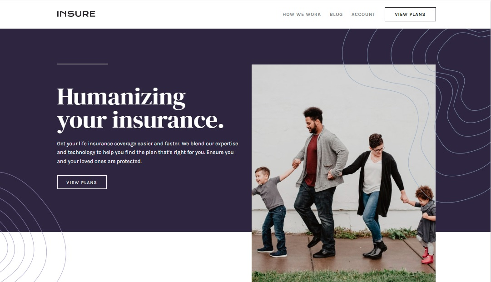
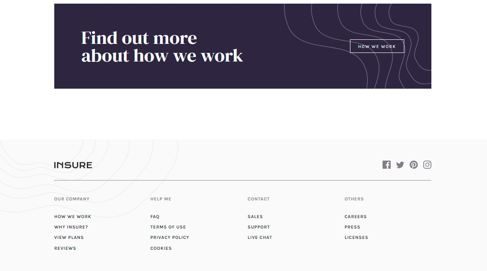
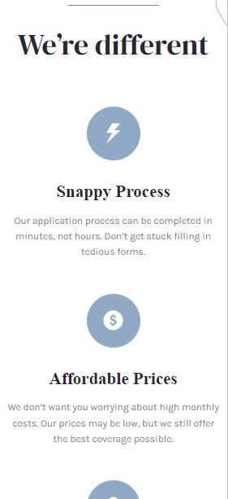

# Frontend Mentor - Insure landing page solution

This is a solution to the [Insure landing page challenge on Frontend Mentor](https://www.frontendmentor.io/challenges/insure-landing-page-uTU68JV8). Frontend Mentor challenges help you improve your coding skills by building realistic projects. 

## Table of contents

- [Overview](#overview)
  - [The challenge](#the-challenge)
  - [Screenshot](#screenshot)
  - [Links](#links)
- [My process](#my-process)
  - [Built with](#built-with)
  - [What I learned](#what-i-learned)
  - [Continued development](#continued-development)
  - [Useful resources](#useful-resources)
- [Author](#author)
- [Acknowledgments](#acknowledgments)

## Overview

### The challenge

Users should be able to:

- View the optimal layout for the site depending on their device's screen size
- See hover states for all interactive elements on the page

### Screenshot

| Desktop layout |
|:--:|
 

| Mobile layout |
|:--:|
  

### Links

- Solution URL: https://github.com/PavlinaPs/insure-landing-page
- Live Site URL: https://pavlinaps.github.io/insure-landing-page/

## My process

### Built with

- Semantic HTML5 markup
- CSS custom properties
- Flexbox
- CSS Grid
- Mobile-first workflow
- Sass
- BEM

### What I learned

This is a great challenge, I used a lot what I've learned in  previous challenges:
  - multiple backgrounds
  - decision if an illustration should be styled as an \ element in HTML or  as an element's background or a pseudo-element
  - hamburger menu, I felt pretty comfortable with the JavaScript
  - nice CSS selectors: 
    ```css
    .footer__contact-group li:not(:first-child) a:hover {
        text-decoration: underline;
    }
    ```
    ```css
    .header__nav.open ~ .header__hamburger {
      display: none;
    }
    ```
  - changed svg's fill color on hover
  - I love CSS grid

I really like the footer in this challenge. I think an effective footer is very important, users expect to find the information there and find it quickly. This footer is neatly sectioned and simple. Just perfect.


### Continued development

I need to optimize the process of styling the hamburger menu. So far it seems the best way to style it is to style the desktop menu first and then in @media style the hidden mobile menu. Which is not the mobile first workflow. I even think the easiest way is to use max-width in @media. Just for the section with navigation.

I would also like to plan for more mixins in next layout. I would like to try to use them kind of like utility classes (which I don't like much, I always forget they are in html file and then wonder why things are behaving the way they do..).


### Useful resources

This time I used only CSS selectors Cheat Sheet which I received in Kyle Cook / WDS's mailings. It's great, as is Kyle.

## Author

- GitHub - [PavlinaPs](https://github.com/PavlinaPs)
- Frontend Mentor - [@PavlinaPs](https://www.frontendmentor.io/profile/PavlinaPs)

## Acknowledgments

It is great that I can solve Frontend Mentor's challenges. They are all very useful for me. Every single one. Thank you!
